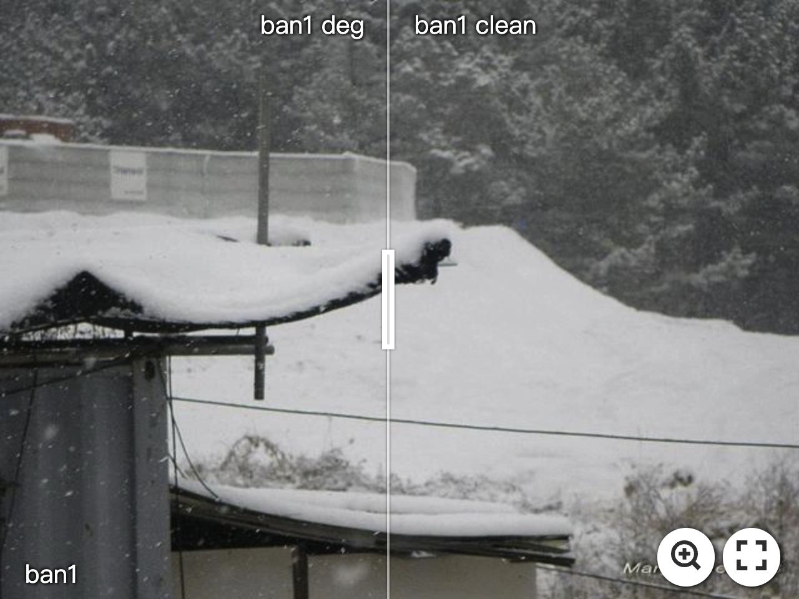

<div align=center class="logo">
      
   </a>
</div>

# Teaching Tailored to Talent: Adverse Weather Restoration via Prompt Pool and Depth-Anything Constraint (ECCV'2024)


> *<a href="https://ephemeral182.github.io">Sixiang Chen</a><sup>1</sup>&nbsp;&nbsp;&nbsp;
<a href="https://owen718.github.io">Tian Ye</a><sup>1</sup>&nbsp;&nbsp;&nbsp;
Kai Zhang</a><sup>1</sup>&nbsp;&nbsp;&nbsp;
<a href="https://ge-xing.github.io/">Zhaohu Xing</a><sup>1</sup>&nbsp;&nbsp;&nbsp;
<a href="https://lyl1015.github.io/">Yunlong Lin<sup>2</sup>&nbsp;&nbsp;&nbsp;
<a href="https://sites.google.com/site/indexlzhu/home">Lei Zhu</a><sup>1,3 ✉️</sup>&nbsp;&nbsp;&nbsp;*

> *<sup>1</sup>The Hong Kong University of Science and Technology (Guangzhou)&nbsp;&nbsp;&nbsp;
<sup>2</sup>Xiamen University&nbsp;&nbsp;&nbsp;<br>
<sup>3</sup>The Hong Kong University of Science and Technology&nbsp;&nbsp;&nbsp;*


<em>European Conference on Computer Vision <strong>(ECCV)</strong>, 2024, MiCo Milano</em>
</div>

</br>

[](https://arxiv.org/abs/2409.15739)
[](https://arxiv.org/abs/2409.15739)
[](https://ephemeral182.github.io/T3-DiffWeather/)


[](https://imgsli.com/Mjk5ODA0) [](https://imgsli.com/Mjk5ODEx)
[](https://imgsli.com/Mjk5ODEy) [](https://imgsli.com/Mjk5ODE0) 
  
## :fire: News

- **2024.09.25**: ✅ Release our code, pretrained models and visual results, welcome to test the performance.
- **2024.09.24**: ✅ Release our [manuscript](https://arxiv.org/abs/2409.15739).
- **2024.7.26**: This repo is created.

## Abstract

> *Recent advancements in adverse weather restoration have shown potential, yet the unpredictable and varied combinations of weather degradations in the real world pose significant challenges. Previous methods typically struggle with dynamically handling intricate degradation combinations and carrying on background reconstruction precisely, leading to performance and generalization limitations. Drawing inspiration from prompt learning and the "<u>T</u>eaching <u>T</u>ailored to <u>T</u>alent" concept, we introduce a novel pipeline, <i><strong>T<sup>3</sup>-DiffWeather</strong></i>. Specifically, we employ a prompt pool that allows the network to autonomously combine sub-prompts to construct weather-prompts, harnessing the necessary attributes to adaptively tackle unforeseen weather input. Moreover, from a scene modeling perspective, we incorporate general prompts constrained by Depth-Anything feature to provide the scene-specific condition for the diffusion process. Furthermore, by incorporating contrastive prompt loss, we ensures distinctive representations for both types of prompts by a mutual pushing strategy. Experimental results demonstrate that our method achieves state-of-the-art performance across various synthetic and real-world datasets, markedly outperforming existing diffusion techniques in terms of computational efficiency.*


## Overview 
  <p align="center">
    
</p>

---

> *Figure 3. The overview of proposed method.  (a) showcases our pipeline, which adopts an innovative strategy focused on learning degradation residual and employs the information-rich condition to guide the diffusion process. (b) illustrates the utilization of our prompt pool, which empowers the network to autonomously select attributes needed to construct adaptive weather-prompts. (c) depicts the general prompts directed by Depth-Anything constraint to supply scene information that aids in reconstructing residuals. (d) shows the contrastive prompt loss, which exerts constraints on prompts driven by two distinct motivations, enhancing their representations.*

## Visual Comparisons
<details>
<summary><strong>Synthetic</strong> (click to expand) </summary>

 
</details>

<details>
<summary><strong>Real</strong> (click to expand) </summary>

 
</details>

## Results
<details>
<summary><strong>Adverse Weather Restoration</strong> (click to expand) </summary>

 
</details>

<details>
<summary><strong>Other Real Datasets</strong> (click to expand) </summary>

 
</details>

<details>
<summary><strong>Parameters and GFLOPs</strong> (click to expand) </summary>

 
</details>

## Installation
:satisfied: Our <i><strong>T<sup>3</sup>-DiffWeather</strong></i> is built in Pytorch=2.0.1, we train and test it on Ubuntu=20.04 environment (Python=3.8+, Cuda=11.6).

For installing, please follow these instructions:
```
conda create -n py38 python=3.8.16
conda activate py38
pip3 install torch torchvision torchaudio
pip3 install -r requirements.txt  
```

## Dataset
:open_file_folder: We train our model in the mixed adverse weather data and evaluate it in <strong>(Raindrop)</strong>, <strong>(Rainhaze (Test1))</strong> and <strong>(Snow100K)</strong>. The download links of datasets are provided.
<table>
  <tr>
    <th align="left"></th>
    <th align="center">Adverse Weather</th>
    <th align="center">Raindrop</th>
    <th align="center">Test1</th>
    <th align="center">Snow100K</th>
  </tr>
  <tr>
    <td align="left">Link</td>
    <td align="center"><a href="https://pan.baidu.com/s/1JwpxYdJlsf81tMrNjMqMXQ">Download</a></td>
    <td align="center"><a href="https://pan.baidu.com/s/1Mk_oh53kbaFmpuh">Download</a></td>
    <td align="center"><a href="https://pan.baidu.com/s/1rk_ZdYuMIOTYeZxqUwi0YA">Download</a></td>
    <td align="center"><a href="https://pan.baidu.com/s/1C-yASmIX5euWKzeG5I9qWw">Download</a></td>
  </tr>
    <tr>
    <td align="left">Code</td>
    <td align="center">nxpx</td>
    <td align="center">5xge</td>
    <td align="center">ifbm</td>
    <td align="center">sacv</td>
  </tr>
 </table>

## Visual Results.
<table>
  <tr>
    <th align="left"></th>
    <th align="center">Raindrop</th>
    <th align="center">Test1</th>
    <th align="center">Snow100K-S</th>
    <th align="center">Snow100K-L</th>
  </tr>
  <tr>
    <td align="left">Google Drive</td>
    <td align="center"><a href="https://drive.google.com/drive/folders/1yDMkMICk_A3m_EIU8mz5zw84ubDGjAbm?usp=sharing">Download</a></td>
    <td align="center"><a href="https://drive.google.com/drive/folders/1UfKqR2SH6zL-lBgggYK0UwgZEEhhTC__?usp=sharing">Download</a></td>
    <td align="center"><a href="https://drive.google.com/file/d/14jkxGp5F_Mpe_afSstdpguDB9CnpFD3j/view?usp=sharing">Download</a></td>
    <td align="center"><a href="https://drive.google.com/file/d/185k2QrYLqSZ3ypZ-sJFvMewtxt6d46p0/view?usp=drive_link">Download</a></td>
  </tr>
   </table>

## Quick Run

:raised_hands: To simply test the demonstration with your **own images or real samples**, please modify the file path needed for testing in val_data_dir beforehand under configs/allweather_demo.yml, and put the [pretrained_model](https://drive.google.com/file/d/1T1SGbHxPwdlqk5rs0-4lD5PVX4SCkpry/view?usp=drive_link) into pretrained folder. Then run the following code: 
```
python test_diffuser_demo.py
```
Then results will be output to the save path of **'save_images_test_Demo'**.

## Benchmark Test

:raised_hands: We provide a test script to test the results of the weight file on the **benchmarks**. Please modify the file path needed for testing in val_data_dir beforehand under configs/allweather_{benchmark}.yml, and put the [pretrained_model](https://drive.google.com/file/d/19_sTMacENPRd8VKo8M6WP4O4SGpzQGRg/view?usp=drive_link) into pretrained folder. Then you can run the following code to test the performance of PSNR and SSIM: 
```
python test_diffuser_paired.py --config configs/allweather_{benchmark}.yaml
```
Then results will be output to the save path of **'save_images_test_{benchmark}'**.

## Training Stage

:yum: Our training process is built upon pytorch_lightning, rather than the conventional torch framework. Please run the code below to begin training <i><strong>T<sup>3</sup>-DiffWeather</strong></i> on Allweather benchmarks. Please modify the file path needed for training in data_dir beforehand and testing in val_data_dir beforehand under configs/allweather_{benchmark}.yml. Example usage to training our model with Test1 benchmark in testing stage of training:
```python
python train_diffusion_pl.py --config configs/allweather_{benchmark}.yaml
```
The logs and checkpoints are saved in ‘**logs**‘.

 
## Citation 
```
@InProceedings{chen2024teaching,
    title     = {Teaching Tailored to Talent: Adverse Weather Restoration via Prompt Pool and Depth-Anything Constraint},
    author    = {Chen, Sixiang and Ye, Tian and Zhang, Kai and Xing, Zhaohu and Lin, Yunlong and Zhu, Lei}, 
    booktitle = {European conference on computer vision},
    year      = {2024},
    organization={Springer}
}
```
## Contact
If you have any questions, please contact the email ephemeral182@gmail.com or schen691@connect.hkust-gz.edu.cn
